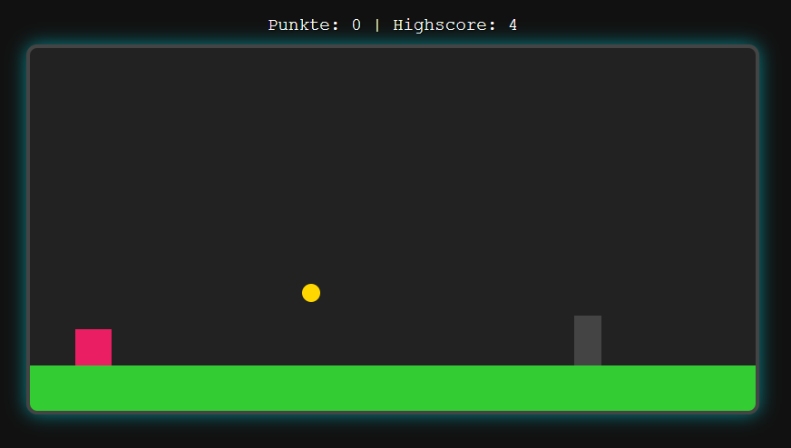

# 🟥 Dash Cube

Dash Cube is a fast-paced, minimalistic jump-and-run browser game where you control a glowing cube.  
Jump over obstacles, collect coins, dash through the level, and survive as long as you can as the game speed increases over time! 🚀

---

## 🎮 Features

- 💠 **Smooth jump physics**
- 💨 **Dash mechanic** (Shift) with particle trails
- 🪙 **Collectible coins**
- ☠️ **Dynamic obstacles**
- 📈 **Score & highscore tracking**
- ⏱️ **Game speed increases every 10 seconds**
- 🌟 Stylish UI with glow effects & animated title screen

---

## 🕹️ Controls

| Key          | Action               |
|--------------|----------------------|
| `Space`      | Jump                 |
| `Shift`      | Dash (short boost)   |

---

## 📦 How to Run

1. Download or clone the repository
2. Open `index.html` in your browser (no server needed)
3. Press `Space` to start — and good luck 😄

---

## 🧠 Tech Stack

- HTML5  
- CSS3 (with animations & keyframes)  
- Vanilla JavaScript (no frameworks)

---
